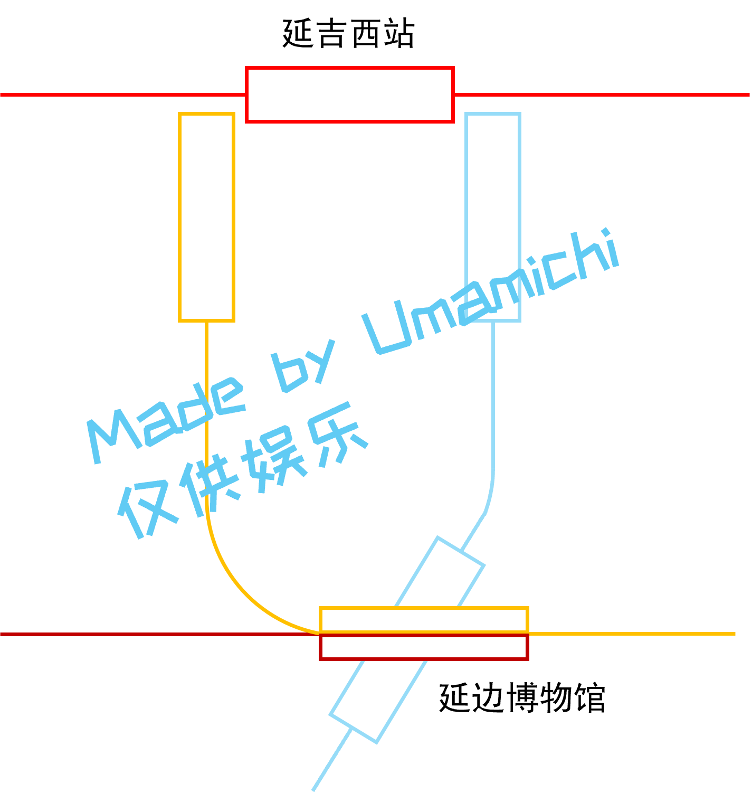
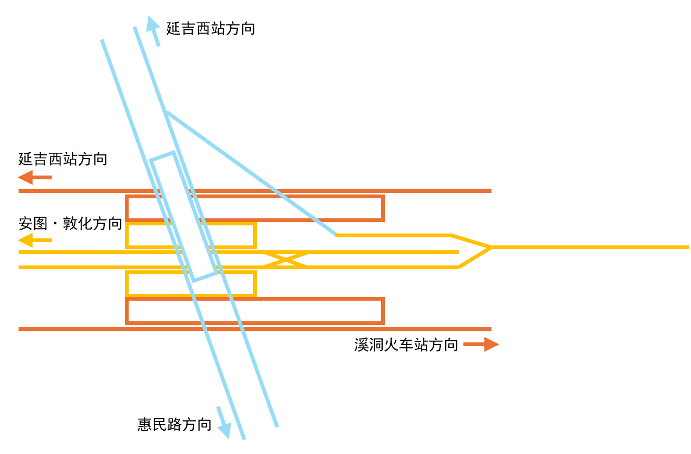

# 主要换乘枢纽

> 以下文本仅供娱乐及铁道爱好者架空铁道设定交流，仅生效于本项目架空的时空内，请不要作为现实决策的参考依据
> 
> 作为现实决策的参考依据，所造成的一切后果和损失，本人及本项目的其他作者概不负责

## 延吉西站

延吉的重要高铁站之一，其在现实世界中也是延吉市的唯一高铁站。其被有意设计为换乘枢纽站。
其采用 H 型换乘，3号线和S3号线的站体夹有1号线站体。

## 延边博物馆

被设计为重要换乘枢纽，其采用现实世界中东方体育中心站类似的设计，可换乘S2、S4和3号线，其中3号线与S4号线同站台换乘。

（以上配线图摘录自 J_C_Y114 的“上海轨道交通全网配线图”的东方体育中心站部分）

（方向画错了...有空重画一版）

## 局子街

位于市中心的1、2号线的换乘站。由于2号线建设空间限制，其采用叠侧式站台。因此本站采用类似于北京地铁七里庄站的“三明治”布局。

-1F：1号线站厅、2号线单侧站台

-2F：1号线站台、2号线站厅

-3F：2号线单侧站台

## 延吉火车站、市政府

两站均为2、3号线的换乘站，且连续，因此两站采用相反的两种同站台换乘组合（据称港铁常用）。
